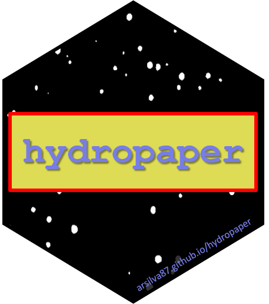

# About



*hydropaper: Water-Sensitive Paper Analysis*

The R package **hydropaper** is up to detect water-sensitive paper from field images and to make analyses of spray performance.

# Getting started

### Taking images in field

First things first! In order to make proper use of *hydropaper* functions and to achieve great results when analyzing images, it is required to have reasonably good images of the paper, specially if taken directly in the crop field. These images below are examples of how to take and how NOT to take images of a paper stuck on a plant leaf. 


The paper is expected to occupy most of the image, like the images at the right side *-- we do not want background!*. Also, it is very important that the paper is as horizontally (or vertically) aligned as possible in order to be correctly detected - if it is somehow rotated, the results will not be so accurate. Keep in mind that a RECTANGLE is to be extracted *-- think as if you are scanning a bar code with your phone camera*.

It is highly recommended that you **take at least three images of each paper**. Do not worry, *hydropaper* can analyze them all at once anyway, so you will not have to waste time in this first step.

Now another important factor is optical resolution. Please make sure that your images have at least 180 PPI. Be aware that too high-resolution images can demand more processing power and time, and sometimes not resulting in better results.

The most common RGB-image formats are accepted, such as .jpg, .png, .tif.

Finally, try to get **as little shadow/sunlight variation as possible over the paper**. It is okay if there is this kind of variation on background, but not over the paper. And no, it does not matter that different images are taken in different light conditions, as long as they are of good quality as the criteria above. We mean something like the image below.


### How to store the images

If you want to make the analyses of all images in a run, save them in a folder. It does not need to be the working directory of the R session. But make sure there is no other file other than the images in that folder.

*hydropaper* makes use of the package *EBImage* to handle the images. Thus, you can use its functions to do pre-processing procedures, like resizing, rotating or else.


### Feeling ready to install it?

You can install the development version from GitHub, using:

```r
install.packages("devtools")
devtools::install_github("arsilva87/hydropaper")
```

Afterwards, just load it and it will be ready to use.

```r
library("hydropaper")
```

Now, take a look at this overview [article]() of the package. 

### Main functions

You can also check out the package documentation to see examples of its functions.

```r
detectPaper()
clipPaper()
analyzePaper()
analyzeImages()
makeReport()
```

For example, run `help(analyzePaper)` and try to reproduce the examples.


# Contact and bug report

**hydropaper** is an ongoing project, supported by the *The Master in Plant Protection Program* - [Instituto Federal Goiano](https://www.ifgoiano.edu.br/home/index.php/urutai)  . Contributions are very welcome. If you have a question or have found a bug, please open an [Issue](https://github.com/arsilva87/hydropaper/issues) or reach out directly by e-mailing [Da Silva](mailto:anderson.silva@ifgoiano.edu.br) or [Dos Santos](mailto:wilhanvalasco@hotmail.com).
