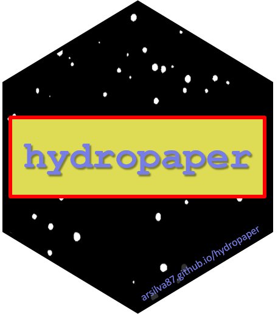

```{r setup, include=FALSE}
knitr::opts_chunk$set(echo=FALSE, message = FALSE, 
                      warning = FALSE, comment="")
```


****

### <span style="color:darkcyan"> Paper (detected) dimensions

```{r}
y <- as.list(params$x)
if(inherits(y, "hydropaper")) {
  dim(y$binary)
} else {
  nlc <- sapply(y, '[[', 'binary', USE.NAMES = TRUE)
  sapply(nlc, dim)
}
```

### <span style="color:darkcyan"> Spray parameters

```{r}
if(inherits(y, "hydropaper")) {
  print(y)
  plot(y)
} else {
  for(i in 1:length(y)) {
    cat(names(y[i]))
    print(y[[i]])
    plot(y[[i]])
  }
}
```


****
<div class="logos"></div>

<font size="1">  Date and time: `r Sys.time()`

This document was automatically generated with package [hydropaper](https://arsilva87.github.io/hydropaper/) 

Powered by *The Master in Plant Protection Program* - [Instituto Federal Goiano](https://www.ifgoiano.edu.br/home/index.php/urutai)  
